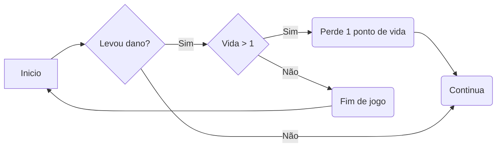

# Sprites

## Tamanho da tela = 1200x740
|                |Largura                        |Altura                       |
|----------------|-------------------------------|-----------------------------|
|Fase 1          |`Não feito`                    |`Não feito`                  |
|Fase 2          |`1200`                         |`740`                        |
|Fase 3          |`Não feito`                    |`Não feito`                  |
|Nurse           |`126`                          |`203`                        |
|Zombie          |`102`                          |`192`                        |
|Ambulância      |`380`                          |`204`                        |
|Buraco          |`96`                           |`96`                         |
|Seringa         |`Não feito`                    |`Não feito`                  |
|Vida            |`Não feito`                    |`Não feito`                  |
|Kit Médico      |`Não feito`                    |`Não feito`                  |
|Porta           |`Não feito`                    |`Não feito`                  |
|Horse           |`240`                          |`192`                        |
|Moose           |`240`                          |`192`                        |
|Fox             |`120`                          |`96`                         |

- Espaçamento entre lanes de 10

